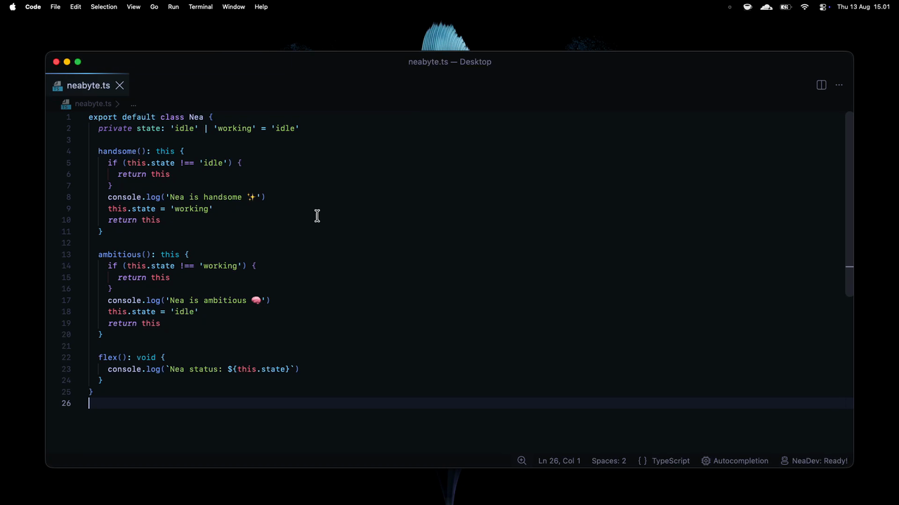
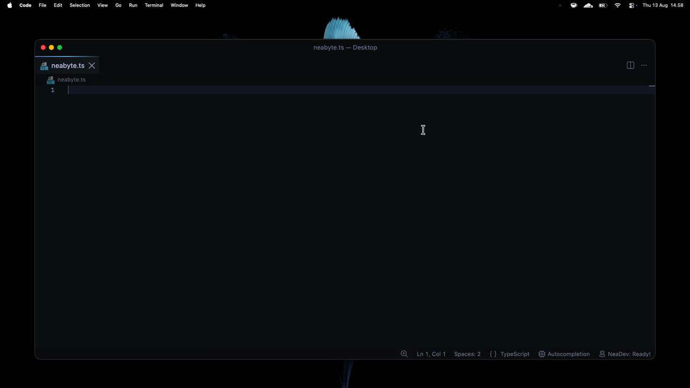
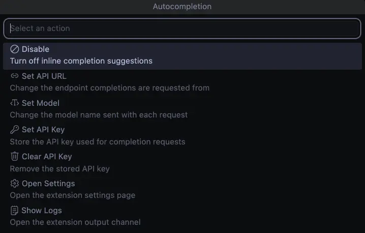

<div align='center'>

# Autocompletion

Next edit suggestions for VS Code using OpenAI-compatible APIs

</div>

<table>
  <tr>
    <td align="center">Tab Chaining</td>
    <td align="center">Auto Completion</td>
  </tr>
  <tr>
    <td></td>
    <td></td>
  </tr>
</table>

Next Edit Suggestions for VS Code, built on the same concept [shared 11 months ago](https://github.com/NeaByteLab/AI-NES). The extension predicts the edit you are about to make and offers it inline, in the same way that [Copilot](https://code.visualstudio.com/blogs/2025/02/12/next-edit-suggestions) and [Cursor](https://cursor.com/help/ai-features/tab) do it. It runs against any model that speaks an OpenAI compatible Responses API. Previously used internally, and now available as a public release.

## How It Works

The extension watches the document while you type and it keeps a short history of your recent edits. On every request it sends the file, the cursor position, the nearby diagnostics, and that history to the model. The model answers with a stream of unified diff hunks, and each hunk turns into one suggestion.

A suggestion on the cursor line renders as ghost text, so a single Tab applies it. A suggestion further down the file renders as an inline edit with a jump hint, so the first Tab moves the caret there and the second Tab writes the change. After every accepted edit the extension asks for another round, which lets one rename chain across the whole file.

## Requirements

- VS Code 1.85 or newer
- Deno for building from source
- An endpoint with an OpenAI compatible Responses API

## Installation

This extension depends on a [proposed VS Code API](https://code.visualstudio.com/api/advanced-topics/using-proposed-api), so the marketplace can never host it.

You install it by hand instead.

```bash
npm run vscode:install
```

The command packages the extension and installs the resulting file. Run `npm run vscode:update` whenever you want to reinstall after a change.

## Commands



| Command                         | Description                                   |
| ------------------------------- | --------------------------------------------- |
| `Autocompletion: Show Options`  | Opens the status bar quick pick menu          |
| `Autocompletion: Set API URL`   | Changes the endpoint for completion requests  |
| `Autocompletion: Set Model`     | Changes the model name sent with each request |
| `Autocompletion: Set API Key`   | Stores the API key in VS Code secret storage  |
| `Autocompletion: Clear API Key` | Removes the stored API key                    |
| `Autocompletion: Open Settings` | Opens the extension settings page             |

The status bar menu offers the same actions, and adds a toggle for enabling or disabling the extension and a shortcut to open the logs.

## Endpoints

Any service with an OpenAI compatible Responses API works, here are a few of them:

- `http://localhost:11434/v1/responses` for Ollama
- `https://openrouter.ai/api/v1/responses` for OpenRouter
- `https://api.minimax.io/v1/responses` for MiniMax
- `https://api.openai.com/v1/responses` for OpenAI

## Usage

Type as usual and the suggestion shows up on its own. Press Tab to accept it and press Escape to dismiss it. A dismissed suggestion moves into a declined list, so the model learns what you refused.

## Development

```bash
deno task check
deno task bundle
```

The first command formats, lints, and type checks the source.

## License

This project is licensed under the MIT license. See the [LICENSE](LICENSE) file for details.
